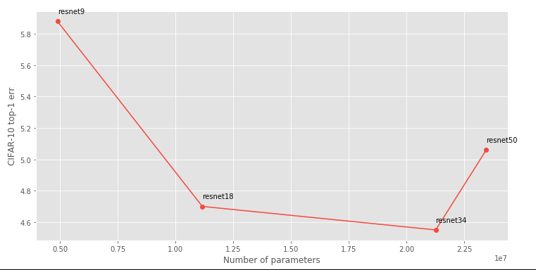
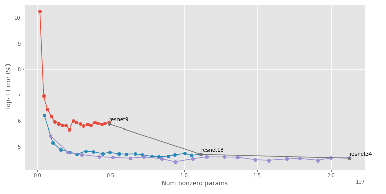

# [Learning both Weights and Connections for Efficient Neural Networks](https://arxiv.org/abs/1506.02626)

[](https://lgtm.com/projects/g/jack-willturner/DeepCompression-PyTorch/alerts/) 
[](https://lgtm.com/projects/g/jack-willturner/DeepCompression-PyTorch/context:python)


------------------
Differences from jack-willturner's 8 Sep 2021 version:

1. Add mobilenetV1/V2 unofficial model for pruning

2. Fix some bugs in structure type pruning.

3. Now shows error history during training & nums of params after pruning by runing ".\checkpoints\print_results.py"

Steps for changing pruning type:

1.Edit line62 in file "./models/conv_bn_relu.py" 
```python
self.mask = UnstructuredMask(...)
```
or
```python
self.mask = structuredMask(...)
```
2.Specific pruning_type and run:
```
python prune.py --model='resnet34' --checkpoint='resnet34' --pruning_type structured
```
------------------

A PyTorch implementation of [this paper](https://arxiv.org/abs/1506.02626).

To run, try:
```bash
python train.py --model='resnet34' --checkpoint='resnet34'
python prune.py --model='resnet34' --checkpoint='resnet34'
```

## Usage 

The core principle behind the training/pruning/finetuning algorithms is as follows:

```python
from models import get_model
from pruners import get_pruner 

model = get_model("resnet18")
pruner = get_pruner("L1Pruner", "unstructured")

for prune_rate in [10, 40, 60, 80]:
    pruner.prune(model, prune_rate)
```

We can choose between structured/unstructured pruning, as well as the pruning methods which are in `pruners` (at the time of writing we have support only for magnitude-based pruning and Fisher pruning).


## Bring your own models 
In order to add a new model family to the repository you basically just need to do two things:
1. Swap out the convolutional layers to use the `ConvBNReLU` class
2. Define a `get_prunable_layers` method which returns all the instances of `ConvBNReLU` which you want to be prunable

## Summary

Given a family of ResNets, we can construct a Pareto frontier of the tradeoff between accuracy and number of parameters:



Han et al. posit that we can beat this Pareto frontier by leaving network structures fixed, but removing individual parameters:


